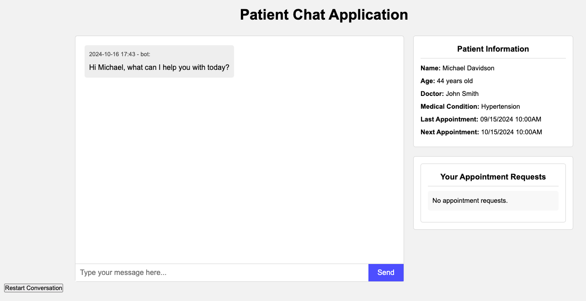

# Patient Chat Application

This Django-based web application allows patients to interact with an AI health assistant, providing personalized health information and managing patient data.

## Key Features

1. **Medication Management**
2. **Appointment Scheduling**
3. **General Health Inquiries**

## User Interface



The interface includes a chat window, message input field, and send button.

## Use Cases

### 1. Medication Query

The AI assistant can gather information about medications, including dosage and frequency.

Example:
```
Patient: I'm taking ibuprofen for my fever.
Bot: What is the dosage for each of your medications?
Patient: ibuprofen, 200mg
Bot: How often do you take each medication?
Patient: ibuprofen, every 6 hours.
Bot: [Provides information about the medication and usage]
```

### 2. Appointment Changes

Patients can request appointment changes, which the AI will forward to the doctor.

Example:
```
Patient: I want to change the appointment to next Monday
Bot: You requested to change your appointment from 2024-10-15 10:00 to next Monday. 
     I will convey your request to Dr. John Smith.
```

### 3. General Health Inquiries

The AI can provide general health advice based on patient queries.

Example:
```
Patient: I twisted my ankle, what should I do?
Bot: [Provides steps to manage a twisted ankle, including rest, ice, compression, 
     elevation, and when to see a doctor]
```

## Implementation Details

The application uses:
- Django backend
- AI integration for natural language processing
- Knowledge graph for storing and retrieving patient information
- Entity extraction for understanding user inputs

For full setup and installation instructions, please refer to the Setup section below.

---

## Table of Contents

- [Features](#features)
- [Technology Stack](#technology-stack)
- [Prerequisites](#prerequisites)
- [Setup and Installation](#setup-and-installation)
  - [Clone the Repository](#clone-the-repository)
  - [Create a Virtual Environment](#create-a-virtual-environment)
  - [Install Dependencies](#install-dependencies)
  - [Configure Environment Variables](#configure-environment-variables)
  - [Set Up the PostgreSQL Database](#set-up-the-postgresql-database)
  - [Set Up Neo4j Graph Database (Optional)](#set-up-neo4j-graph-database-optional)
  - [Create a Patient Profile](#create-a-patient-profile)
  - [Run the Application](#run-the-application)
- [Implementation Details](#implementation-details)
  - [Backend](#backend)
  - [Frontend](#frontend)
  - [AI Integration](#ai-integration)
  - [Database Schema](#database-schema)
  - [Entity Extraction](#entity-extraction)
  - [Knowledge Graph Integration](#knowledge-graph-integration)
  - [Agent System](#agent-system)
- [User Interface](#user-interface)
- [Future Enhancements](#future-enhancements)
- [Contributing](#contributing)
- [License](#license)

---

## Features

- Interactive chat interface for patients to communicate with an AI health assistant.
- Personalized responses based on patient data.
- Entity extraction from patient messages to update medical records.
- Knowledge graph integration using Neo4j for advanced data retrieval.
- Supports Retrieval Augmented Generation (RAG) for improved AI responses.

---

## Technology Stack

- **Backend:** Django
- **Frontend:** Django Templates (provided by Django framework)
- **AI Integration:** Langchain, Langgraph
- **Databases:**
  - **Primary Database:** PostgreSQL
  - **Graph Database:** Neo4j
- **Language Model:** OpenAI GPT models via `langchain-openai` (configurable to other LLMs)
- **Dependencies:** Listed in `requirements.txt`

---

## Prerequisites

Before you begin, ensure you have the following installed on your system:

- Python 3.10 
- PostgreSQL
- Neo4j (for knowledge graph features)
- Git

---

## Setup and Installation

### 1. Clone the Repository

```bash
git clone https://github.com/yourusername/patient-chat-app.git
cd patient-chat-app
```

### 2. Create a Virtual Environment

```bash
conda create -n patient_chat_app python=3.10
conda activate patient_chat_app
```

### 3. Install Dependencies

Ensure that `pip` is up to date and install the required packages:

```bash
pip install --upgrade pip
pip install -r requirements.txt
```

### 4. Configure Environment Variables

Create a `.env` file in the project root directory and add the following environment variables:

```env
# OpenAI API Key (or your chosen LLM provider)
OPENAI_API_KEY=sk-...

# Database Settings
DB_NAME=...
DB_USER=...
DB_PASSWORD=...
DB_HOST=localhost # or your host
DB_PORT=5432 # or your port number

# NEO4J Settings
NEO4J_URI=neo4j+s://...io
NEO4J_USERNAME=neo4j
NEO4J_PASSWORD=3g...
```

### 5. Set Up the PostgreSQL Database

- **Install PostgreSQL:**
  - Download and install PostgreSQL from [the official website](https://www.postgresql.org/download/).
- **Create a Database:**
  - Open the PostgreSQL shell or use a GUI tool like pgAdmin.
  - Create a new database named `patient_chat_db`.
- **Update Database Settings:**
  - Ensure your `.env` file contains the correct database credentials.

### 6. Set Up Neo4j Graph Database 

- **Install Neo4j:**
  - Download and install Neo4j from [the official website](https://neo4j.com/docs/operations-manual/current/installation/).
- **Create a New Instance Using AuraDB Free:**
  - Sign up for a free account at [Neo4j Aura](https://neo4j.com/cloud/aura/).
  - Create a new database instance and follow the setup instructions provided.
  - Validate that your Aura instance is available by visiting [Neo4j Console](https://console.neo4j.io).
- **Update Neo4j Settings:**
  - Ensure your `.env` file contains the correct Neo4j credentials, including the AuraDB connection URI and credentials.

### 7. Create a Patient Profile

The application requires at least one patient profile to function. You can create a patient profile using the Django shell.

- **Run Django Migrations:**

  ```bash
  python manage.py makemigrations
  python manage.py migrate
  ```

- **Open the Django Shell:**

  ```bash
  python manage.py shell
  ```

- **Create a Patient Instance:**

  ```python
  from patients.models import Patient
  from django.utils import timezone
  from datetime import datetime

  patient = Patient.objects.create(
      first_name='Michael',
      last_name='Davidson',
      date_of_birth=datetime(1980, 1, 1).date(),
      phone_number='858-539-0000',
      email='michael@example.com',
      medical_condition='Hypertension',
      medication_regimen='Lisinopril 10mg once daily',
      last_appointment_datetime=timezone.make_aware(datetime(2024, 9, 15, 10, 0)),
      next_appointment_datetime=timezone.make_aware(datetime(2024, 10, 15, 10, 0)),
      doctor_name='Dr. John Smith'
  )
  ```

- **Exit the Shell:**

  ```python
  exit()
  ```

### 8. Run the Application

Start the Django development server:

```bash
python manage.py runserver
```

Open your web browser and navigate to `http://localhost:8000` to access the application.

---

## Implementation Details

### Backend

The backend is built with Django, providing robust support for web applications and easy integration with databases.

- **Apps:**
  - `chat`: Handles the chat interface and conversation logic.
  - `patients`: Manages patient data and models.
  - `ai_bot`: Contains AI-related logic, including language model integration and knowledge graph interactions.

### Frontend

The frontend of the application is built using Django Templates, providing a seamless integration with the Django backend. The user interface is designed to be intuitive and user-friendly, allowing patients to easily interact with the AI health assistant.

### AI Integration

- **Langchain and Langgraph:**
  - Used for integrating Large Language Models (LLMs) and implementing Retrieval Augmented Generation (RAG).
- **Language Model:**
  - The application uses OpenAI GPT models via `langchain-openai`.
  - Configurable to use other LLMs by modifying the `LLM_PROVIDER` and related settings in the `.env` file.

### Database Schema

#### PostgreSQL

Used as the primary relational database for storing patient data, conversation history, and other structured information.

#### Neo4j (Optional)

Utilized for the knowledge graph, enabling advanced data retrieval and relationships.

- **Graph Schema:**

  ```text
  (:Patient)
      -[:TAKES]->(:Medication {name: String, dosage: String, frequency: String})
      -[:HAS]->(:HealthIssue {description: String})
      -[:SCHEDULES]->(:Appointment {time: String})
      -[:HAS_LAB_TEST]->(:LabTest {name: String})
      -[:HAS_NOTE]->(:DoctorNote {content: String})
      -[:HAS_VITAL]->(:Vital {
          weight: String, 
          height: String, 
          blood_pressure: String, 
          heart_rate: String, 
          temperature: String
      })
      -[:HAS_ALLERGY]->(:Allergy {name: String})
      -[:HAS_FAMILY_HISTORY]->(:FamilyHistory {description: String})
      -[:HAS_LIFESTYLE_FACTOR]->(:LifestyleFactor {description: String})
      -[:HAS_IMMUNIZATION]->(:Immunization {name: String, date: String})

  (:Medication)-[:HAS_DOSAGE]->(:Dosage {value: String})
  (:Medication)-[:HAS_FREQUENCY]->(:Frequency {value: String})
  ```

### Entity Extraction

- **LLM with Pydantic Model:**
  - Uses an LLM to parse user input and extract entities based on a predefined Pydantic model.
- **Chain Setup:**
  - The chain is configured as `chain = prompt | llm | json_parser` to process and extract entities.

### Knowledge Graph Integration

- **Neo4j Vector Index:**
  - Utilizes `Neo4jVector` for vector storage and retrieval.
- **Advanced RAG Strategies:**
  - Implements hybrid search combining vector similarities and contextual attributes.
- **Natural Language Interface:**
  - Leverages Langchain's `GraphCypherQAChain` to allow natural language queries against the Neo4j graph.

### Agent System

The application now includes an advanced agent system implemented in `ai_bot/agent.py`. This system enhances the AI's ability to process user inputs, manage conversation flow, and interact with the knowledge graph.

Key features of the agent system include:

- **State Management:** Uses a `StateGraph` to manage the conversation state and flow.
- **Entity Extraction:** Extracts relevant entities from user input.
- **Dynamic Follow-up Questions:** Asks follow-up questions when necessary information is missing.
- **Knowledge Graph Integration:** Interacts with the Neo4j knowledge graph to store and retrieve patient information.
- **Conditional Logic:** Uses conditional edges to determine the next step in the conversation flow.

The agent system follows these main steps:
1. Extract entities from user input
2. Check for missing required entities
3. Ask follow-up questions if needed
4. Generate a response based on the available information

This system allows for more dynamic and context-aware conversations, improving the overall user experience.

---

## User Interface

For the simplicity of the project, the user interface is minimalistic and only contains the chat window and input field. User can choose to delete the chat history by clicking the `Restart` button.


Key elements of the interface include:
- A chat window displaying the conversation history
- An input field for patients to type their messages
- A send button to submit messages
- A `Restart` button to delete the chat history
This interface provides a straightforward and accessible way for patients to communicate with the AI health assistant, ask questions, and receive personalized health information.

---

## Future Enhancements

- **Agent System Improvements:**
  - Expand the agent's capabilities to handle more complex medical scenarios.
  - Implement more sophisticated decision-making algorithms within the agent system.
  - Enhance the integration between the agent system and other components of the application.

---

## Contributing

We welcome contributions from the community! Please follow these steps:

1. Fork the repository.
2. Create a new branch for your feature or bug fix.
3. Commit your changes with descriptive messages.
4. Push your branch to your forked repository.
5. Open a pull request against the main repository.

---

## License

This project is licensed under the [MIT License](LICENSE).

---

Thank you for using the Patient Chat Application! If you have any questions or need assistance, please feel free to reach out.

---

# Additional Notes

## Requirements

All dependencies are listed in the `requirements.txt` file. Ensure you have installed all required packages using:

```bash
pip install -r requirements.txt
```

## Environment Variables

Ensure all environment variables are correctly set in your `.env` file to avoid any runtime errors.

## Patient Data

Currently, the system is designed for efficiency with a single patient profile but can accommodate multiple patients as needed.

## Neo4j Setup (Optional)

If you choose to enable the knowledge graph features:

- Download and install Neo4j from [the official website](https://neo4j.com/docs/operations-manual/current/installation/).
- Start the Neo4j server and ensure it's running.
- Update the Neo4j settings in your `.env` file.

## Changing the Language Model

You can switch to other language models supported by Langchain:

- Visit [Langchain LLM Integrations](https://python.langchain.com/docs/integrations/llms/) for available options.
- Update the LLM provider and API key in your `.env` file and adjust the code in `ai_bot/langchain_integration.py` accordingly.

## Database Configurations

Ensure that your PostgreSQL and Neo4j databases are properly configured and running before starting the application.

## Running Migrations

After any changes to the models, run:

```bash
python manage.py makemigrations
python manage.py migrate
```